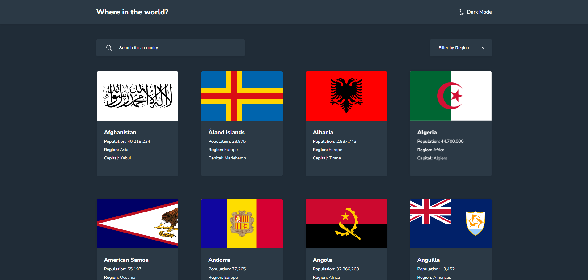
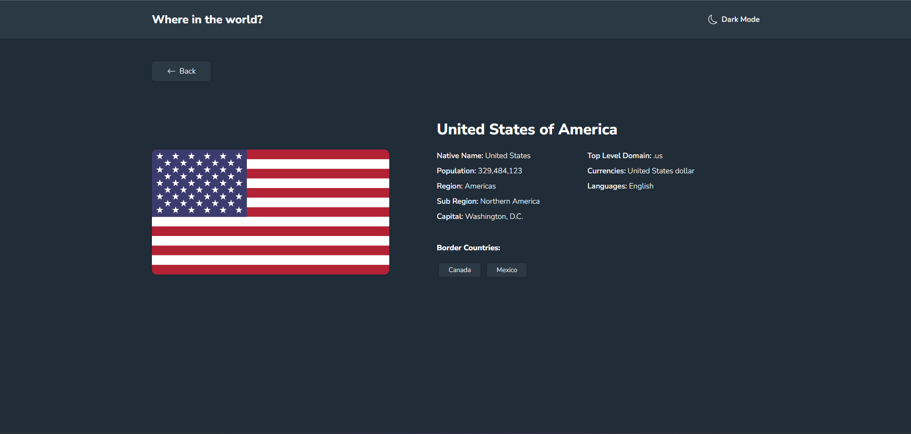

# Frontend Mentor - REST Countries API with color theme switcher solution

This is a solution to the [REST Countries API with color theme switcher challenge on Frontend Mentor](https://www.frontendmentor.io/challenges/rest-countries-api-with-color-theme-switcher-5cacc469fec04111f7b848ca). Frontend Mentor challenges help you improve your coding skills by building realistic projects. 

## Table of contents

- [Overview](#overview)
  - [The challenge](#the-challenge)
  - [Screenshots](#screenshots)
  - [Links](#links)
- [My process](#my-process)
  - [Built with](#built-with)
  - [Useful resources](#useful-resources)
- [Author](#author)

## Overview

### The challenge

Users should be able to:

- See all countries from the API on the homepage
- Search for a country using an `input` field
- Filter countries by region
- Click on a country to see more detailed information on a separate page
- Click through to the border countries on the detail page
- Toggle the color scheme between light and dark mode

### Screenshots

### Links

- Solution URL: [https://github.com/cganzon/where-in-the-world](https://github.com/cganzon/where-in-the-world)
- Live Site URL: [https://restcountries-cg.herokuapp.com/](https://restcountries-cg.herokuapp.com/)

## My process

### Built with

- Flexbox
- CSS custom properties
- Mobile-first workflow
- Local storage
- [Node.js](https://nodejs.org/en) - JavaScript Runtime environment
- [EJS](https://ejs.co/) - Embedded JavaScript Templating

### Useful resources

- [The Web Developer Bootcamp](https://www.udemy.com/course/the-web-developer-bootcamp/) - This Udemy course by Colt Steele was my number one guide for constructing this project. I recommend it for aspiring developers to delve deep into full-stack web development.

## Author

- GitHub - [cganzon](https://github.com/cganzon)
- Frontend Mentor - [@cganzon](https://www.frontendmentor.io/profile/cganzon)
